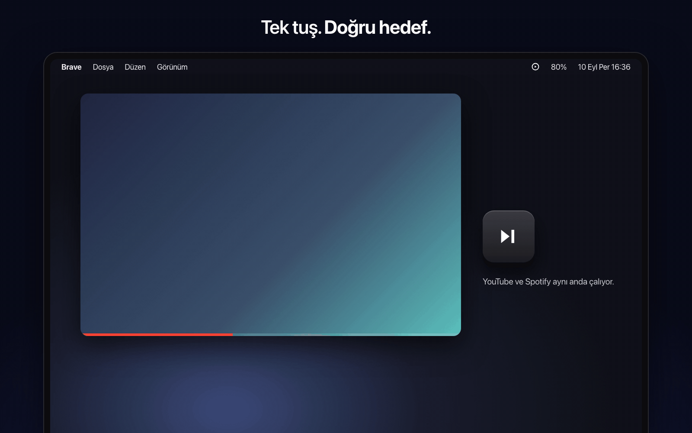
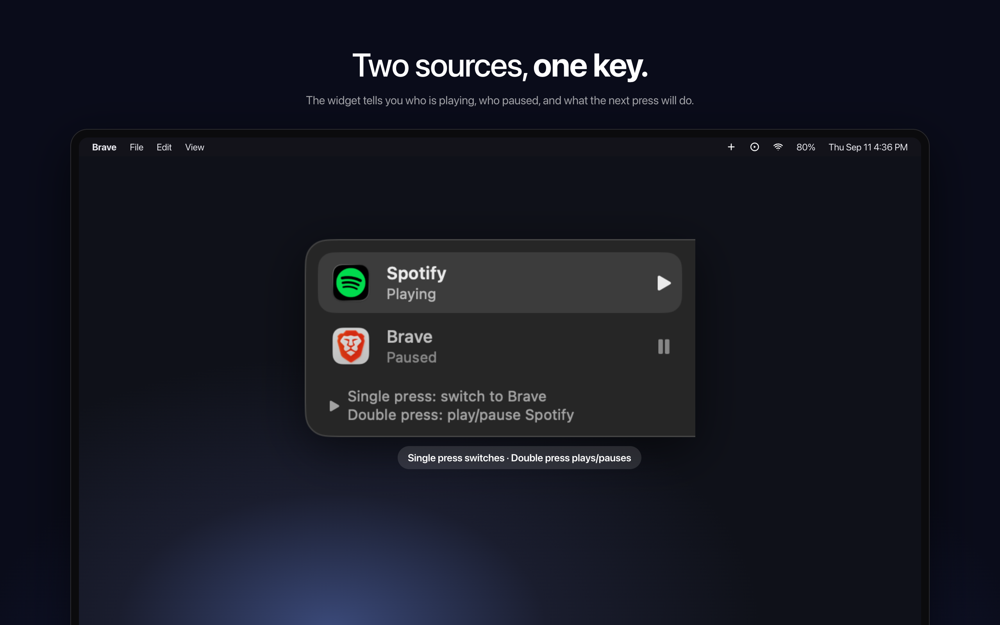
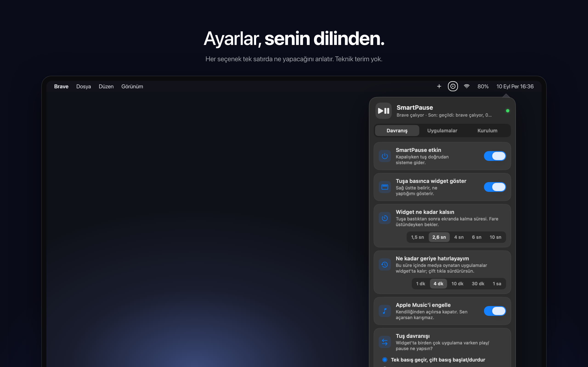
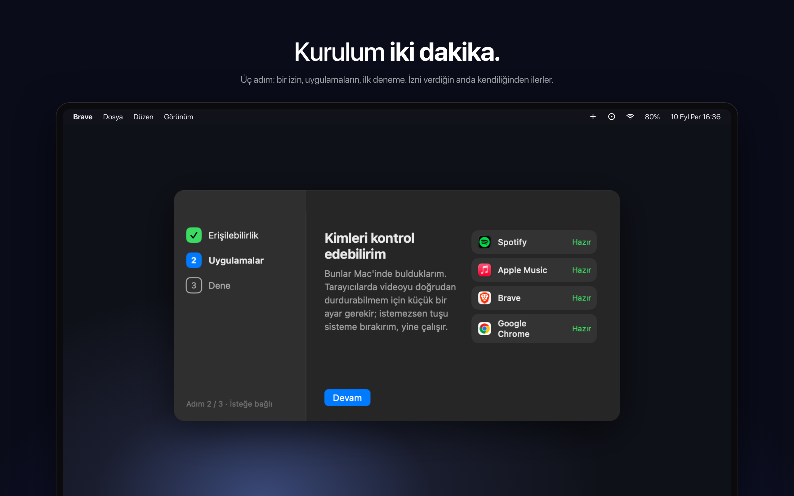
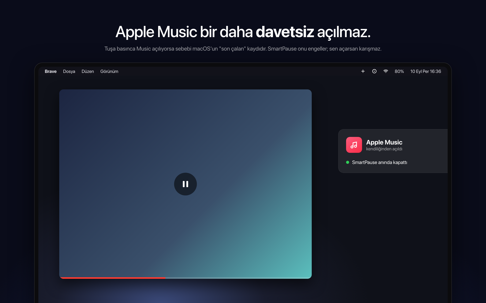

<div align="center">

# SmartPause

**Play/pause tuşu artık gerçekten çalanı durdurur.**

macOS için akıllı media key yönlendirici. YouTube, Spotify, VLC: ses kimden geliyorsa o durur. Apple Music davetsiz açılmaz.

[](https://github.com/yasinozmeen/smartpause/releases/latest)




<br><br>

<table>
  <tr>
    <td></td>
    <td></td>
  </tr>
  <tr>
    <td></td>
    <td></td>
  </tr>
</table>

</div>

## Sorun

macOS'ta play/pause tuşu "şu an ses çıkaran" uygulamayı değil, sistemin "son çalan" kaydındaki uygulamayı hedefler; çoğu zaman hiçbirini. Sonuç: YouTube'u durdurmak istersin, Apple Music açılır. SmartPause tuşu yakalar, o an gerçekten ses çıkaran uygulamayı bulur ve komutu ona iletir.

## Ne yapar

- **Tek tuş, doğru hedef.** Ses kimden geliyorsa o durur; kimse çalmıyorsa en son durdurduğun sürer.
- **İki kaynak, tek tuş.** YouTube ve Spotify aynı anda çalıyorsa: tek basış diğerine geçer, çift basış seçili olanı başlatır/durdurur. Davranış ayarlanabilir.
- **Widget.** Tuşa basınca sağ üstte belirir: kim çalıyor, kim durdu, bir sonraki basış ne yapacak.
- **Apple Music engeli.** Kendiliğinden açılırsa kapatır; sen açarsan karışmaz.
- **Next / previous** tuşları Spotify, Apple Music ve VLC'de çalışır.

## Nasıl çalışır

1. **Tuş yakalama** — `CGEventTap` ile play/pause/next/prev tuşları yakalanır (Erişilebilirlik izni).
2. **Ses tespiti** — Core Audio'nun public process API'si (macOS 14.2+) ile o an ses çıkaran process bulunur. Mikrofon/ses kaydı izni gerekmez, boşta CPU maliyeti sıfırdır.
3. **Hedefe komut** — Adapter mimarisi: Spotify, Apple Music, VLC ve tarayıcılar (Chrome, Brave, Arc, Safari) AppleScript ile kontrol edilir. Adapter'ı olmayan uygulamada tuş sisteme aynen bırakılır; asla ölü tuş kalmaz.
4. **Music engelleyici** — Apple Music kendiliğinden açılırsa hemen kapatılır (isteğe bağlı, menüden kapatılabilir).

Private API kullanılmaz. Tek istisna helper process → ana uygulama eşlemesi için `responsibility_get_pid_responsible_for_pid`; izole edilmiştir ve bulunamazsa güvenli şekilde devre dışı kalır.

## Kurulum

Homebrew (yakında):

```bash
brew install --cask yasinozmeen/smartpause/smartpause
```

Kaynaktan:

```bash
git clone https://github.com/yasinozmeen/smartpause && cd smartpause
./scripts/bundle.sh && open build/SmartPause.app
```

İlk açılışta:
- **Erişilebilirlik** izni istenir (zorunlu). Sistem Ayarları › Gizlilik ve Güvenlik › Erişilebilirlik.
- İlk tuş basışında macOS her uygulama için bir kez **Otomasyon** izni sorar.
- Tarayıcı içindeki videoyu doğrudan kontrol etmek için Chrome/Brave'de Görünüm › Geliştirici › "Apple Events'ten JavaScript'e izin ver", Safari'de Geliştirme › Geliştirici Ayarları'nda aynı seçenek. **İsteğe bağlı:** kapalıysa tuş sisteme bırakılır ve tarayıcı çalarken zaten doğru çalışır.

## Durum

v0.1 — Spotify, Brave, Chrome ve Safari canlı doğrulandı (PRD başarı kriteri: 3 tarayıcı ✓). Arc ve VLC adapter'ları yazıldı, test bekliyor. Yol haritası ve teknik notlar: [docs/NOTES.md](docs/NOTES.md).

Gereksinim: macOS 14.2+ (Sonoma), Apple Silicon veya Intel.

## Lisans

MIT
